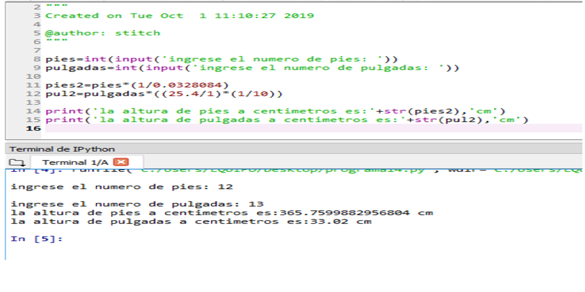
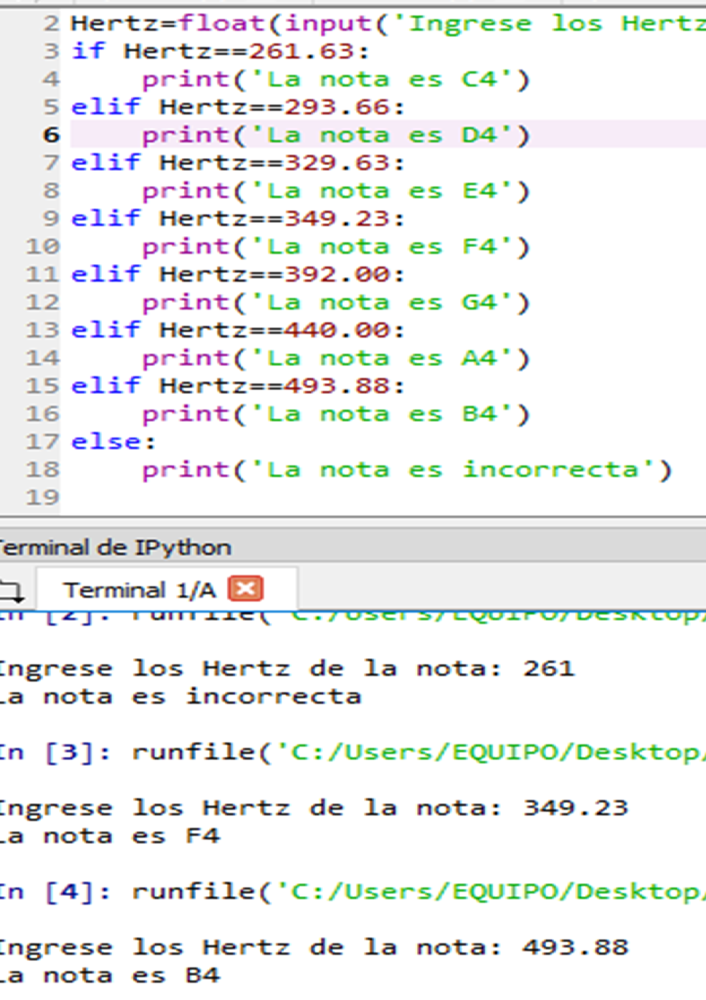

# Tecnologico de Estudios Superiores de Huixquilucan
### Ingenieria Mecatronica
### Asignatura: Programación avanzada
### Asesor. Dr. Enrique García Trinidad
### Alumno. Brayan Adrian Navarrete Maltos

### Plataforma python
### Que es python?
Python es un lenguaje de programación creado por Guido van Rossum a principios de los años 90. 
El programa favorece una sintaxis muy limpia ya que favorece un codigo legible. Se trata de un lenguaje interpretado o de script, con tipado dinamico, fuertemente tipado, multiplatoforma orientada a objetos.

### Lenguaje interpretado o de Script
Un lenguaje interpretado o de Script es aque que se ejecuta utilizando un programa de intermedio llamado interprete, en lugar de compilar el codigo al lenguaje maquina que puede comprender y ejecutar directamente la computadora "Lenguajes compilados".
La ventaja de los lenguajes compilados es que en su ejecución es más rápida.
Sin embargo, los lenguajes interpretados son más flexibles y más portátiles. Python es un ejemplo de un lenguaje de alto nivel como C ++, C #, PHP, Pascal y Java, los idiomas de alto nivel se consideran los lenguajes maquina o lenguajes de ensamblador sin embargo, los idiomas de alto nivel simpre tienen que ser convertidos a lenguajes de bajo nivel poara que puedan correr.
El lenguaje de programacion python guarda sus scripts en terminacion archivo.py

### Tipado dinamico
La caracteristica de tipado dinamico  a que no es necesario declarar  el tipo de dato que va a contener una determinada variable  si no que segun su tipo  de valor al que se le asigne y al tipo de esta variable puede cambiar si se le asigna un valor de otro tipo.

### Fuertemente tipado 
No se pertmite tratar una variable  como si fuera de un tipo distinto al que tiene es necesario convertir de forma explicit dicha variable al nuevo tipo previamente .
Ejemplo: Si tenemos una variable que contiene un texto 1 variable de tipo cadena o string 1 no podemos tratarlo como un numero 1 sumar la cadena "9"+8.

### Multiplataforma 
El interprete de python esta disponible en multitud de plataformas  (UNIX, SOLARIS , LINUX, DOS , WINDOWS, MAC OS) Por lo tanto si noutilizamos librerias especificas de esta plataforma nuestro programa podra correr  en estos sistemas sin grandes cambios 

### Orientada a objetos
La orientacion a objetos es un paradigma de programacion en el que los conceptos del mundo real relevantes para nuestro problema se trasladan a clases y objetos en nuestro programa la ejecucion del programa consiste en una serie de interacciones entre los objetos .

### Por que python ?
El software es el nucleo de todas las herramientas que utilizamos hoy en dia casi todos usamos redes sociales para comunicarnos muchaspersonas estan conectadas a internet todo el dia , y la mayoria de los trabajos siempre se interactuan con una computadora o para tener el trabajo hecho. Como resultado la demanda de las personas que sepan programar a aumentado .
Python es un lenguaje que con su sintaxis simple, clara y sencilla puede automatizar simples tareas como mover, nombrar o reciclar archivos, llenar de forma automatica formularios en internet, descargar archivos o extraer informacion de paginas de internet de forma masiva, hace que su computadora le envie a su telefono informacion de quien la esta usando , checar su email y contestarlo de manera automatica.

Para poder programar en python es necesario instalar su programa lo cual es muy facil solo hay que ir a la pagina ANACONDA PYTHON y descargar la  version  3.7 para 64 bits es de gran importancia señalar el sistema  en el cual lo vamos a trabajar, ya instalado el programa procederemos a la programacion y para ello en el buscador del sistema indicamos la palabra spyder ya que este es el programa donde haremos todos nuestros programas.

### Programa No.1 
El comando print imprime un mensaje en la pantalla o en otro dispositivo de salida. El mansaje puede ser una cadena de caracteres o cualquier objeto que sea convertible a cadena de caracteres. 
El comando del programa es el siguiente: https://github.com/Brayan-Adrian/Programacion-Avanzada/blob/master/Ej1%20Cual%20es%20tu%20nombe.py
Y tambien lo podemos ver en la siguinete imagen.

### Programa No.2
El comando print imprime un mensaje en la pantalla o en otro dispositivo de salida. El mansaje puede ser una cadena de caracteres o cualquier objeto que sea convertible a cadena de caracteres. 
El comando input permite al usuario introducir informacion utilizando el teclado la variable donde se guarda dicha informacion es de tipo string o cadena de caracteres.
El comando int convierte a tipo entero.
El comando float convierte a tipo decimal.
El comando del programa es el siguiente:https://github.com/Brayan-Adrian/Programacion-Avanzada/blob/master/Ej2%20Nombre%2C%20edad%2C%20estatura.py
Y tambien lo podemos ver en la siguinete imagen.
 

### Programa No.3
Escribe un programa que desplieje su nombre y su direccion de tal manera que pueda escribir en un sobre de correo , su programa no tiene que leerningun dato de entrada por el usuario.
En este programa solo se utilizara el comando print ya que solo requiere que imprima el mensaje en el sobre de la carta, a continuacion se presenta el codigo programado de lado izquiero y del lado derecho la compilacion.

### Programa No.4
Escriba un programa que le pregunte al usuario el largo y el anchode una habitacion. Una vez que los valore han sido leidos su programa debe calcular y desplegar el area de la habitacion. El largo y el ancho debe de ser introducido con punto flotante (decimal) Incluya las unidades metros en su mensaje de estrada y de salida.

### Programa No.5
Crea un programa que lea el largo y ancho de un campo de cultivo, introducido por el usuario y despliege el area del campo en acres

### Programa de tarea No.6

En muchos establecimientos, se agrega un pequeño depósito a los envases de bebidas para alentar a las personas a reciclarlos. En una jurisdicción en particular, los envases de bebidas con un litro o menos tienen un depósito de $0.10, y los envases de bebidas con más de un litro tienen un depósito de $ 0.25.
Escriba un programa que lea el número de contenedores de cada tamaño del usuario. Su programa debe continuar calculando y mostrando el reembolso que se recibirá por devolver esos contenedores. Formatee la salida para que incluya un signo de dólar y siempre muestre exactamente dos decimales.

Solucion: hay que resaltar que solo nos estan pidiendo dos decimales para eso se utilizara el siguiente codigo "$%.2f' %" a la hora de que muestre el resultado de la operacion, las variables de las botellas a introducir seran de tipo en tero ya que no podemos introducir decimales en dicha orden, y la operacion del rembolso se realiza multiplicando las botellas ya sean chicas o grandes por la variable establecida, y despues sumar las dos variables, para que quede mejor entendible se presentara a continuacion el siguiente codigo. https://github.com/Brayan-Adrian/Programacion-Avanzada/blob/master/EjTarea.py
Y tambien lo podemos ver en la siguinete imagen.

### Programa No.7
Escriba un programa que lea un numero positivo (n), insertado por el usuario y despues despliege la suma de todos los enteros desde 1 hasta n. La suma de los primeros enteros n positivos puede ser calculado usando la formula suma=(n)(n+1)

Solucion. Insertamos un numero cualquiera, en este caso se eligio 5 ya que es el mas facil de comprobar y calcularlo mentalmente, la formua se muestra en la parte de arriba, el codigo es el siguiente. https://github.com/Brayan-Adrian/Programacion-Avanzada/blob/master/Ej7.py

### Programa No.8
Hacer un programa en el que el usuario introduzca el nombre de la comida que ordeno en un restaurante y su precio despues su programa debe calcular el subtotal, el iva y la propina, de toda la cuenta la salida del programa debe parecerse a un ticket de restaurante. Use un iva de 16% y una propina del 15% del subtotal. Los valores numericos deben tener dos decimales.

Solucion. Para poder llegar al objetivo de lo indicado pondremos el nombre y el valor de 5 comidas, con el comando print seguido de str haremos el nombre de la comida y con el valor de la comida de igual forma el comando print seguido del comando int. crearemos las varibles Subtotal, IVA, Propina para poderlas sumar y muestre al final el monto total, el codigo es el siguiente.
https://github.com/Brayan-Adrian/Programacion-Avanzada/blob/master/Ej6%20Ticket.py
Y tambien lo podemos ver en la siguiente imagen.

### Programa No.9
Un vendedor de una pagina de abarrotes en linea vende dos tipos de cajas de cereal. CornFlakes de 750gr y Trix de 500gr. Escriba un programa que lea el numero de cajas de CornFlakes y cajas de Trix, cuyo valor debe ser introducido por el usuario. Despues, su programa debe calcular y mostrar el total del peso (en kilogramos).

Solucion. Empezamos agregando las constantes T, y C de las cajas ya que son los gramos que pesa cada una, y las multiplicamos por las variables que van hacer el numero que el usuario introducira.
Hacemos una variable que haga la operacion de sumar los gramos por las cajas a introducir y las dividimos entre 1000 para que nos imprima los kilogramos, el codigo es el siguiente.https://github.com/Brayan-Adrian/Programacion-Avanzada/blob/master/Ej8%20Peso%20de%20las%20cajas.py
Y tambien lo podemos ver en la siguiente imagen.

### Programa de tarea No.10 Aritmetica
Cree un programa que lea dos valores enteros, a y b, introducidos por el usuario. Su programa debe desplegar la suma de a y b 
La diferencia cuando a es sustraido de b 
El cociente cuando a divide a b
El residuo cuando a divide a b 
El resultado de log(a)
El resultado de a a la potencia b 

Solucion. Un tip a utilizar es mandando a llamar la libreria Math la cual no ubicaremos en la parte de abajo de la plataforma spyder y pondremos import math seguido de comando enter para que nos despliege la lista de funciones matematicas, el codigo es el siguiente.https://github.com/Brayan-Adrian/Programacion-Avanzada/blob/master/Aritmetica.py
Y tambien lo podemos ver en la siguiente imagen.

### Programa de tarea No.11 Eficiencia de combustible
En los Estados Unidos, la eficiencia del combustible para vehículos se expresa normalmente en millas por galón (MPG). En México, la eficiencia del combustible normalmente se expresa en litros por cien kilómetros (L / 100km). Usa tus habilidades de investigación para determinar cómo convertir de MPG a L / 100km. Luego, cree un programa que lea un valor del usuario en unidades estadounidenses y muestre la eficiencia de combustible equivalente en unidades mexicanas.

Solucion para poder convertir de MPG a L/100km es hacer la siguiente conversion multiplicar el numero introducido por 1.609 millas y despues dividirlo entre 3.78 que es lo que equivale a un galon, el codigo es el siguiente.https://github.com/Brayan-Adrian/Programacion-Avanzada/blob/master/Ej%20Tarea%202%20Eficiencia%20conbustible.py
Y tambien lo podemos ver en la siguiente imagen.

### Programa No.12 Distancia entre dos puntos de la tierra.

La superficie de la tierra es cuerva y la distancia entre grados de longitud varia con la latitud.
Como resultado, encontrar la distancia entre dos puntos de la superficie de la tierra es mas complicado que usar el teorema de pitagoras
Si (t1,g1) y (t2,g2) es la latitud y longitud de dos puntos de la superficie de la Tierra. La distancia entre, esos puntos atraves de la superficie de la tierra, en kilometros es;

distancia=6371.01*arccos(sen(t1)*sen(t2)+cos(t1)*cos(t2)*cos(g1-g2))

Cree un programa que le permita al usuario introducir la latitud y longitud de dos puntos de la tierra en grados su programa debe pesplejar la distancia entre esos puntos, en kilometros. Tenga en cuenta que las funciones trigonometricas en python trabajan en radianes, por lo que debe de convertir el valor introducido por el usuario en grados a radianes antes de utilizar la formula. El modulo math contiene el comando radians, que cambia de grados a radianes.

Solucion. Para poder realizar el siguiente ejercicio importaremos la libreria math a la plataforma donde se este programando, introduciremos las variables t1, t2, g1 y g2 ya que son las coordenadas de latitud y longitud de la formula que se muestra en la parte de arriba en la descripcion del ejercicio, despues introduciremos otras variables de lat1, lat2, log1 y log2 pero esta ya con la formula predeterminada para convertir de grados a radianes, sustituimos las variable de la operacion en la variable formula para despues mandarlos a llamar en la inpresion print, el codigo es el siguiente.https://github.com/Brayan-Adrian/Programacion-Avanzada/blob/master/Ej12%20latitud%20y%20longitud.py
Y tambien lo podemos ver en la siguiente imagen.

### Programa No.13 Haciendo el cambio.

Considere el software que se ejecuta en una máquina de autopago. Una tarea que debe ser capaz de realizar es determinar cuánto cambio proporcionar cuando el comprador paga para una compra en efectiv.o Escriba un programa que comience leyendo una cantidad de centavos del usuario como entero. Luego, su programa debe calcular y mostrar las denominaciones de monedas que deberían usarse para dar esa cantidad de cambio al comprador. El cambio debe administrarse utilizando la menor cantidad de monedas posible. Suponga que la máquina está cargada con centavos, monedas de cinco centavos, monedas de diez centavos, cuartos, locos y toonies.

Solucion Para poder realizar el siguiente programa metemos cual es el valor de Toonie=200, Loonie=100, quarter=25, dime=10, nickel=5 como constantes para poder dividir el valor de los centavos introducidos por el usuario y que este de los centavos de la cantidad que se introducira, el codigo es el siguiente.https://github.com/Brayan-Adrian/Programacion-Avanzada/blob/master/programa13.py
Y tambien lo podemos ver en la siguiente imagen.

### Programa No. 14 Unidades de altura.

Muchas personas piensan en su altura en pies y pulgadas, incluso en algunos países que utiliza principalmente el sistema métrico. Escriba un programa que lea un número de pies de el usuario, seguido de varias pulgadas. Una vez que se leen estos valores, su programa
debe calcular y mostrar el número equivalente de centímetros.

Solucion. El siguiente ejercicio se basa principalmente en que el usuario introduzca su altura en pies y pulgadas con un print con su respectiva variable, para ello debemos de saber que 1ft=30.48cm y 1in=2.54cm para poder hacer la conversion, el codigo es el siguiente.https://github.com/Brayan-Adrian/Programacion-Avanzada/blob/master/programa15.py
Y tambien lo podemos ver en la siguiente imagen.

### Programa No.15 Unidades de distancia.

En este ejercicio, creará un programa que comienza leyendo una medida en pies del usuario. Entonces su programa debe mostrar la distancia equivalente en pulgadas, yardas y millas. Use Internet para buscar los factores de conversión necesarios si no los tienes memorizados.

Solucion. Como vimos el ejercicio anterior necesitamos buscar a cuanto equivalen 1 pulgada en pies, 1 yarda en pies y 1 milla en pies a continuacion se presentan la quivalencia de cada una.
1in=0.83ft
1yarda=3ft
1milla=5280
el codigo es el siguiente.https://github.com/Brayan-Adrian/Programacion-Avanzada/blob/master/programa14.py
Y tambien lo podemos ver en la siguiente imagen.

### Programa No.16 Area y Volumen 

Escriba un programa que comience leyendo un radio, r, del usuario. El programa continúe calculando y mostrando el área de un círculo con radio r y el volumen de una esfera con radio r. Use la constante pi en el módulo matemático en su cálculo.

Solucion. Para poder desarrollar el siguiente programa le pidiremos alusiario que introduzca el radio para despues mandar llamar la libreria math y hacia poder calcular las constantes como pi la formula para calcular el area y el volumen son las siguientes.
area = π*r**2.
volume = 4/3πr**3.
el codigo es el siguiente.https://github.com/Brayan-Adrian/Programacion-Avanzada/blob/master/programa16.py
Y tambien lo podemos ver en la siguiente imagen.

### Programa No.17 Capacidad calorífica
La cantidad de energía requerida para aumentar la temperatura de un gramo de material. en un grado Celsius es la capacidad de calor específica del material, C. La cantidad total de energía requerida para elevar m gramos de un material en ΔT grados Celsius puede ser calculado usando la fórmula:

### q=m*C*(t2-t1)

Extienda su programa para que también calcule el costo de calentar el agua. Electricidad normalmente se factura utilizando unidades de kilovatios hora en lugar de julios. En este ejercicio, debe suponer que la electricidad cuesta 8,9 centavos por kilovatio-hora. Utilizar
su programa para calcular el costo de hervir agua por una taza de café.

Solucion. Para darle solucion al ejercicioes necesario conocer la capacidad calorífica específica del agua la cual es 4.186 J/g◦C. Porque el agua tiene una densidad de 1.0 gramo por mililitro, hay que tambien tomar encuenta que necesitamos un exponencial la cual llamaremos con la la libreria math y las varibles de volumen y temperatura la pondremos con un float ya que lo que introducira el usuario vendra en decimales, el codigo es el siguiente.https://github.com/Brayan-Adrian/Programacion-Avanzada/blob/master/programa17.py
Y tambien lo podemos ver en la siguiente imagen.

### Programa No.18 Volumen de un cilindro

El volumen de un cilindro se puede calcular multiplicando el área de su circular base por su altura. Escriba un programa que lea el radio del cilindro, junto con su altura, desde el usuario y calcula su volumen. Mostrar el resultado redondeado a uno decimal.

Solucion. importaremos la libreria math para poder utilizar pi para asi poder multiplicarlo por el radio. Las variables ingresadas por el usuario deben de ir con un float ya que el usuario puede meter decimales, el codigo es el siguiente,https://github.com/Brayan-Adrian/Programacion-Avanzada/blob/master/programa18.py
Y tambien lo podemos ver en la siguiente imagen.

### Programa No.19 Caida Libre

Cree un programa que determine qué tan rápido viaja un objeto cuando golpea el suelo. El usuario ingresará la altura desde la cual se cae el objeto en metros (m). Debido a que el objeto se cae, su velocidad inicial es de 0 m / s. Supongamos que la aceleración debido a la gravedad es de 9.8m / s2. Puedes usar la fórmula 

### vf = squrt vi+2ad 
para calcular la velocidad final, vf, cuando se conoce la velocidad inicial, vi, aceleración, a y distancia, d.

Solucion, Empezaremos importando la libreria math ya que con esta podremos indicar la raiz de la operacion y determinaremos las constantes de la gravedad y de la velocidad inicial ya que parte del reposo, el codigo es el siguiente,https://github.com/Brayan-Adrian/Programacion-Avanzada/blob/master/programa19.py
Y tambien lo podemos ver en la siguiente imagen.

### Programa No.20 Ley de los gases ideales.

La ley de los gases ideales es una aproximación matemática del comportamiento de los gases como cambio de presión, volumen y temperatura. Por lo general, se indica como:
### PV = nRT
donde P es la presión en Pascales, V es el volumen en litros, n es la cantidad de sustancia en moles, R es la constante de gas ideal, igual a 8.314 J/mol K, y T es el temperatura en grados Kelvin.
Escriba un programa que calcule la cantidad de gas en moles cuando el usuario suministra. La presión, el volumen y la temperatura. Prueba tu programa determinando el número de moles de gas en un tanque de buceo. Un tanque de buceo típico contiene 12 litros de gas a una presión de 20,000,000 Pascales (aproximadamente 3,000 PSI). La temperatura ambiente es aproximadamente 20 grados Celsius o 68 grados Fahrenheit. 

Solucion. Lo principal a desarrolar es el despeje de n en la formula de los gases ideales no es necesario llamar la libreria math ya que es una operacion sencilla, las otras costantes ya estan dadas como la temperatura la presion etc, https://github.com/Brayan-Adrian/Programacion-Avanzada/blob/master/Ej%2020%20Gas%20ideal.py
Y tambien lo podemos ver en la siguiente imagen.

### Programa No.21 Area de un triangulo.

El área de un triángulo se puede calcular usando la siguiente fórmula, donde b es la longitud de la base del triángulo, y h es su altura:
### área =(b × h)/2
Escriba un programa que permita al usuario ingresar valores para b y h. El programa luego debe calcular y mostrar el área de un triángulo con longitud base b y altura h.
Solucion Meteremos los datos del usuario como numeros enteros para las medidad del triangulo, no es necesario llamar la libreria math ya que es una operacion sencilla, https://github.com/Brayan-Adrian/Programacion-Avanzada/blob/master/Ej%2020%20Gas%20ideal.py
Y tambien lo podemos ver en la siguiente imagen.

### Programa No.22 Area de un triangulo (Again).

En el ejercicio anterior, creó un programa que calculaba el área de un triángulo cuando se conocía la longitud de su base y su altura. También es posible calcular el área de un triángulo cuando se conocen las longitudes de los tres lados. Deje s1, s2 y s3
ser la longitud de los lados. Sea s = (s1 + s2 + s3) / 2. 
Entonces el área del triángulo se puede calcular usando la siguiente fórmula: área = sqrt s × (s - s1) × (s - s2) × (s - s3)
Desarrolle un programa que lea las longitudes de los lados de un triángulo del usuario y
Muestra su área.
Solucion. En este caso es necesario llamar a la libreria math ya que utilizaremos la raiz para sacar el area del triangulo, y despues poner las variables de S1, S2 Y S3 estas las introduciremos como enteros, antes de poner la formula es necesario resaltar que antes de sqrt va la libreria math de la siguiente manera math.sqrt, https://github.com/Brayan-Adrian/Programacion-Avanzada/blob/master/Ej.%2022%20Area%20del%20triangulo.py
Y tambien lo podemos ver en la siguiente imagen.

### Programa No.23 Area de un poligono regular.

Un polígono es regular si sus lados tienen la misma longitud y los ángulos entre todos
Los lados adyacentes son iguales. El área de un polígono regular se puede calcular usando la siguiente fórmula, donde s es la longitud de un lado n es el número de lados:

### área = (n*(s**2))/(4*(tan(π/n)))

Escriba un programa que lea s y n del usuario y luego muestre el área de un polígono regular construido a partir de estos valores.

Solucion. Manejaremos la libreria math ya que el numero pi y tan antes de escribirlo debemos de declararlos con la libreria como se muestra a continuacion math.pi y math.tan podemos tambien declarar pi como una constante, https://github.com/Brayan-Adrian/Programacion-Avanzada/blob/master/Ej%2023%20Poligono%20regular.py
Y tambien lo podemos ver en la siguiente imagen.

### Programa No.24 Unidades de tiempo.

Cree un programa que lea una duración del usuario como un número de días, horas, minutos y segundos. Calcule y muestre el número total de segundos representados por esta duración.

Solucion. Pondremos unas variables llamadas dias, horas, minutos y segundos que el usuario introducira despues declararemos las la operacion de tal manera que nos convierta los dias horas minutos en segundos y los segundos que introduzca el usuario solo se sumen con la operacion indicada, tomemos como dato que un dia tiene 86400 segundos, una hora 3600 segundos y un minuto tiene 60 segundos, al final lo sumamos creando una variable llamada total para imprimir solo los segundos, el codigo es el siguiente, https://github.com/Brayan-Adrian/Programacion-Avanzada/blob/master/Ej%2025%20Unidades%20de%20tiempo.py
Y tambien lo podemos ver en la siguiente imagen.

### Programa No.25 Unidades de tiempo (de nuevo).

En este ejercicio revertirá el proceso descrito en el ejercicio anterior. Desarrolle un programa que comience leyendo un número de segundos del usuario. Luego, su programa debe mostrar la cantidad de tiempo equivalente en el formulario D: HH: MM: SS, donde D, HH, MM y SS representan días, horas, minutos y segundos respectivamente. Las horas, minutos y segundos deben estar formateados para que
Ocupan exactamente dos dígitos, con un 0 inicial si es necesario.

Solucion. Como lo hicimo en el anterior programa pusimos las constantes en el programa para despues dividir los segundos que el usuario introducira entre los segundos que vale un dia una hora o un segundo para poder hacer que el programa nos de dos digitos pondremos el %00.d en el resultado, el codigo es el siguiente, https://github.com/Brayan-Adrian/Programacion-Avanzada/blob/master/Ej.26%20Revierte%20la%20fecha.py
Y tambien lo podemos ver en la siguiente imagen.

### Programa No.26 Tiempo actual.

Python incluye una biblioteca de funciones para trabajar con el tiempo, incluida una función llamado asctime en el módulo de tiempo. Lee la hora actual de la computadora reloj interno y lo devuelve en un formato legible para humanos. Escribir un programa que muestra la hora y fecha actuales. Su programa no requerirá ninguna entrada de el usuario.

Solucion. Empezaremos importando la libreria Time esto con el fin de solo imprimir la hora actual con el siguiinet codigo print(time.strftime("%H:%M:%S")) #Formato de 24 horas, el codigo es el siguiente, https://github.com/Brayan-Adrian/Programacion-Avanzada/blob/master/Programa%2027.py
Y tambien lo podemos ver en la siguiente imagen.

### Programa No.27 Tiempo actual.

Escriba un programa que calcule el índice de masa corporal (IMC) de un individuo. El programa debe comenzar leyendo una altura y un peso del usuario. Entonces debería usar una de las siguientes dos fórmulas para calcular el IMC antes de mostrarlo. Si lees la altura en pulgadas y el peso en libras, entonces el índice de masa corporal es calculado usando la siguiente fórmula:
IMC = (peso /(altura × altura))× 703. Si lee la altura en metros y el peso en kilogramos, entonces el índice de masa corporal se calcula utilizando esta fórmula ligeramente más simple:IMC = peso /(altura × altura)

Solucion. Utilizaremos un los condicionales if para darle los rangos de IMC para ello nos guiaremos en la siguiente imagen.

ya sabiendo esto declararemos los elif con su mayo o menor o igual que, el codigo es el siguiente, https://github.com/Brayan-Adrian/Programacion-Avanzada/blob/master/Indice%20de%20masa%20corporal.py
Y tambien lo podemos ver en la siguiente imagen.

### Programa No.28 Escalofríos.

Cuando el viento sopla en clima frío, el aire se siente aún más frío de lo que realmente es porque el movimiento del aire aumenta la velocidad de enfriamiento de los objetos calientes, como personas. Este efecto se conoce como sensación térmica. En 2001, Canadá, el Reino Unido y los Estados Unidos adoptaron lo siguiente fórmula para calcular el índice de sensación térmica. Dentro de la fórmula Ta está el La temperatura del aire en grados Celsius y V es la velocidad del viento en kilómetros por hora. Se puede usar una fórmula similar con diferentes valores constantes con temperaturas en grados Fahrenheit y velocidades del viento en millas por hora.
WCI = 13.12 + 0.6215Ta - 11.37V ** 0.16 + 0.3965TaV ** 0.16
Escriba un programa que comience leyendo la temperatura del aire y la velocidad del viento del usuario. Una vez que se hayan leído estos valores, su programa debería mostrar la sensación térmica índice redondeado al entero más cercano.

Solucion.El codigo es el siguiente, https://github.com/Brayan-Adrian/Programacion-Avanzada/blob/master/programa28.py
Y tambien lo podemos ver en la siguiente imagen.

### Programa No.29 Grados Celisious a Grados Farenheit y Kelvn.

Escriba un programa que comience leyendo la temperatura del usuario en grados Celsius. Entonces su programa debe mostrar la temperatura equivalente en grados Fahrenheit y grados Kelvin. Los cálculos necesarios para convertir entre diferentes unidades de temperatura se pueden encontrar en internet.
Solucion.El codigo es el siguiente, https://github.com/Brayan-Adrian/Programacion-Avanzada/blob/master/programa29.py
Y tambien lo podemos ver en la siguiente imagen.

### Programa No.30 Unidades de presion.

En este ejercicio creará un programa que lee la presión del usuario en kilopascales. Una vez que se ha leído la presión, su programa debe informar el equivalente presión en libras por pulgada cuadrada, milímetros de mercurio y atmósferas. Utilizar sus habilidades de investigación para determinar los factores de conversión entre estas unidades.

Solucion.El codigo es el siguiente, https://github.com/Brayan-Adrian/Programacion-Avanzada/blob/master/programa30.py
Y tambien lo podemos ver en la siguiente imagen.

### Programa No.31 Suma de los dígitos en un entero.

Desarrolle un programa que lea un número entero de cuatro dígitos del usuario y muestre la suma de los dígitos en el número. Por ejemplo, si el usuario ingresa 3141, entonces su programa debería mostrar 3 + 1 + 4 + 1 = 9.

Solucion.El codigo es el siguiente, https://github.com/Brayan-Adrian/Programacion-Avanzada/blob/master/programa31.py
Y tambien lo podemos ver en la siguiente imagen.

### Programa No.32 Ordenar 3 enteros.

Cree un programa que lea tres enteros del usuario y los muestre ordenados orden (de menor a mayor). Usa las funciones min y max para encontrar el más pequeño y valores más grandes. El valor medio se puede encontrar calculando la suma de los tres valores, y luego restando el valor mínimo y el valor máximo.

Solucion.El codigo es el siguiente, https://github.com/Brayan-Adrian/Programacion-Avanzada/blob/master/programa32.py
Y tambien lo podemos ver en la siguiente imagen.

### Programa No.33 Pan de un día.

Una panadería vende hogazas de pan por $ 3.49 cada una. El pan de un día tiene un descuento de 60 por ciento. Escriba un programa que comience leyendo la cantidad de panes de un día pan que se compra al usuario. Entonces su programa debe mostrar el regular precio del pan, el descuento porque tiene un día y el precio total. Todo los valores deben mostrarse con dos decimales y los puntos decimales en todos de los números deben alinearse cuando el usuario ingresa valores razonables.

Solucion.El codigo es el siguiente, https://github.com/Brayan-Adrian/Programacion-Avanzada/blob/master/programa33.py
Y tambien lo podemos ver en la siguiente imagen.

### Programa No.34 ¿Par o impar?

Escriba un programa que lea un número entero del usuario. Entonces su programa debería muestra un mensaje que indica si el entero es par o impar.
Solucion.El codigo es el siguiente, https://github.com/Brayan-Adrian/Programacion-Avanzada/blob/master/Ej%2034.py
Y tambien lo podemos ver en la siguiente imagen.

### Programa No.35 Años perro.

Se dice comúnmente que un año humano es equivalente a 7 años de perro. Sin embargo esto la conversión simple no reconoce que los perros alcanzan la edad adulta en aproximadamente dos años. Como resultado, algunas personas creen que es mejor contar cada uno de los dos primeros años humanos como 10.5 años de perro, y luego cuente cada año humano adicional como 4 años perro.
Escribir un programa que implemente la conversión de años humanos a años de perros.
descrito en el párrafo anterior. 
Asegúrese de que su programa funcione correctamente para conversiones de menos de dos años humanos y para conversiones de dos o más humanos años. Su programa debe mostrar un mensaje de error apropiado si el usuario ingresa Un número negativo.
Solucion.El codigo es el siguiente, https://github.com/Brayan-Adrian/Programacion-Avanzada/blob/master/47.0.py
Y tambien lo podemos ver en la siguiente imagen.

### Programa No.36 Vocal o Consonante.
En este ejercicio creará un programa que lee una letra del alfabeto del usuario. Si el usuario ingresa a, e, i, o u, entonces su programa debería mostrar un mensaje indicando que la letra ingresada es una vocal. Si el usuario ingresa y entonces su programa
debería mostrar un mensaje que indique que a veces y es una vocal, y a veces y es una consonante. De lo contrario, su programa debería mostrar un mensaje que indica que el La letra es una consonante.
Solucion.El codigo es el siguiente, https://github.com/Brayan-Adrian/Programacion-Avanzada/blob/master/Programa36.py
Y tambien lo podemos ver en la siguiente imagen.

### Programa No.37 Nombra esa forma.
Escriba un programa que determine el nombre de una forma a partir de su número de lados. Leer el número de lados del usuario y luego informa el nombre apropiado como parte de un mensaje significativo. Su programa debe admitir formas con 3 hasta (e incluyendo) 10 lados. Si se ingresa un número de lados fuera de este rango entonces su programa debería mostrar un mensaje de error apropiado.
Solucion.El codigo es el siguiente, https://github.com/Brayan-Adrian/Programacion-Avanzada/blob/master/Programa%2037.py
Y tambien lo podemos ver en la siguiente imagen.

### Programa No.38 Nombre del mes a la cantidad de días.
La duración de un mes varía de 28 a 31 días. En este ejercicio crearás un programa que lee el nombre de un mes del usuario como una cadena. Entonces el programa debe mostrar la cantidad de días en ese mes. Mostrar "28 o 29 días" para febrero para que se aborden los años bisiestos.
Solucion.El codigo es el siguiente, https://github.com/Brayan-Adrian/Programacion-Avanzada/blob/master/Programa38.py
Y tambien lo podemos ver en la siguiente imagen.

### Programa No.39 Niveles de sonido.
La siguiente tabla enumera el nivel de sonido en decibelios para varios ruidos comunes.

tabla.

Escriba un programa que lea un nivel de sonido en decibelios del usuario. Si el usuario ingresa un nivel de decibelios que coincide con uno de los ruidos en la tabla y luego su programa debería mostrar un mensaje que contenga solo ese ruido. Si el usuario ingresa un número de decibelios entre los ruidos enumerados, entonces su programa debería mostrar un mensaje indicando entre qué ruidos se encuentra el nivel. Asegúrese de que su programa también genere salida razonable para un valor más pequeño que el ruido más bajo en la tabla, y para un valor mayor que el ruido más alto en la tabla.
Solucion.El codigo es el siguiente, https://github.com/Brayan-Adrian/Programacion-Avanzada/blob/master/Programa39.py
Y tambien lo podemos ver en la siguiente imagen.

### Programa No.40 Nombra ese triángulo.
Un triángulo se puede clasificar en función de la longitud de sus lados como isósceles equiláteros o escaleno.
Los 3 lados de un triángulo equilátero tienen la misma longitud. Un isósceles el triángulo tiene dos lados que tienen la misma longitud y un tercer lado que es diferente longitud. Si todos los lados tienen diferentes longitudes, entonces el triángulo es escaleno.
Escriba un programa que lea las longitudes de 3 lados de un triángulo del usuario. Mostrar un mensaje que indique el tipo de triángulo
Solucion.El codigo es el siguiente, https://github.com/Brayan-Adrian/Programacion-Avanzada/blob/master/Programa39.py
Y tambien lo podemos ver en la siguiente imagen.

### Programa No.41 Nota a frecuencia
La siguiente tabla enumera una octava de notas musicales, comenzando con C central, a lo largo con sus frecuencias

tabla. Comience escribiendo un programa que lea el nombre de una nota del usuario y muestra la frecuencia de la nota. Su programa debe admitir todas las notas enumeradas previamente.
Una vez que tenga su programa funcionando correctamente para las notas enumeradas anteriormente, debería agregar soporte para todas las notas de C0 a C8. Si bien esto podría hacerse por agregando muchos casos adicionales a su declaración if, tal solución es engorrosa,
inelegante e inaceptable para los propósitos de este ejercicio. En cambio, deberías explotar la relación entre notas en octavas adyacentes. En particular, la frecuencia de cualquier nota en octava n es la mitad de la frecuencia de la nota correspondiente en octava n + 1. Al usar esta relación, debería poder agregar soporte para las notas adicionales sin agregar casos adicionales a su declaración if. 

### Programa No.42 Frequency To Note
En la pregunta anterior, convertiste del nombre de la nota a la frecuencia. En esta pregunta escribirás un programa que invierta ese proceso. Comience leyendo una frecuencia del usuario Si la frecuencia está dentro de un Hertz de un valor listado en la tabla de la pregunta anterior, informe el nombre de la nota. De lo contrario, informe que el la frecuencia no corresponde a una nota conocida. En este ejercicio solo necesitas considere las notas enumeradas en la tabla. No hay necesidad de considerar notas de otros octavas
Solucion.El codigo es el siguiente,
Y tambien lo podemos ver en la siguiente imagen.

### Programa No.43 Caras sobre el dinero
Es común para las imágenes de los líderes anteriores de un país u otras personas de la historia significado, aparecer en su dinero. Las personas que aparecen en los billetes en los Estados Unidos se enumeran en la Tabla.
tabla.
Escriba un programa que comience leyendo la denominación de un billete del usuario. Luego, su programa debe mostrar el nombre de la persona que aparece en el billete de la cantidad ingresada. Se debe mostrar un mensaje de error apropiado si no existe tal nota.
Solucion.El codigo es el siguiente, https://github.com/Brayan-Adrian/Programacion-Avanzada/blob/master/44.py
Y tambien lo podemos ver en la siguiente imagen.

### Programa No.44 Fecha de nombre de vacaciones
Canadá tiene tres feriados nacionales que caen en las mismas fechas cada año.
tabla.
Escriba un programa que lea un mes y un día del usuario. Si el mes y el dia coincidir con uno de los días festivos enumerados anteriormente, entonces su programa debería mostrar el nombre de vacaciones De lo contrario, su programa debe indicar que el mes ingresado y día no corresponde a un día festivo de fecha fija.
Solucion.El codigo es el siguiente, https://github.com/Brayan-Adrian/Programacion-Avanzada/blob/master/44.py
Y tambien lo podemos ver en la siguiente imagen.

### Programa No.45 ¿De qué color es ese cuadrado?
Las posiciones en un tablero de ajedrez se identifican con una letra y un número. La carta identifica la columna, mientras que el número identifica la fila, como se muestra a continuación:
tabla.
Escriba un programa que lea una posición del usuario. Use una declaración if para determinar si la columna comienza con un cuadrado negro o un cuadrado blanco. Luego use modular aritmética para informar el color del cuadrado en esa fila. Por ejemplo, si el usuario ingresa a1 entonces su programa debe informar que el cuadrado es negro. Si el usuario ingresa d5 entonces su programa debe informar que el cuadrado es blanco. Su programa puede asumir que siempre se ingresará una posición válida. No necesita realizar ningún error
comprobación.

### Programa No.46 Temporada de mes y día
El año se divide en cuatro estaciones: primavera, verano, otoño e invierno. Mientras que las fechas exactas en que cambian las estaciones varían un poco de un año a otro debido a la manera en que se construye el calendario, utilizaremos las siguientes fechas para este ejercicio:
tabla.
Cree un programa que lea un mes y un día del usuario. El usuario ingresará el nombre del mes como una cadena, seguido del día dentro del mes como un entero. Luego, su programa debe mostrar la temporada asociada con la fecha en que fue ingresado.
Solucion.El codigo es el siguiente, https://github.com/Brayan-Adrian/Programacion-Avanzada/blob/master/Ej%2046.py
Y tambien lo podemos ver en la siguiente imagen.

### Programa No.47 Fecha de Nacimiento al Signo Astrológico
Los horóscopos comúnmente reportados en los periódicos usan la posición del sol en el momento del nacimiento para intentar predecir el futuro. Este sistema de astrología divide el año en doce signos del zodiaco, como se describe en la tabla a continuación:
imagen.
Escriba un programa que le pida al usuario que ingrese su mes y día de nacimiento. Entonces su programa debe informar el signo del zodiaco del usuario como parte de una salida adecuada mensaje.
Solucion.El codigo es el siguiente, https://github.com/Brayan-Adrian/Programacion-Avanzada/blob/master/47.py
Y tambien lo podemos ver en la siguiente imagen.

### Programa No.48 Zodiaco Chino
Los horóscopos comúnmente reportados en los periódicos usan la posición del sol en el momento del nacimiento para intentar predecir el futuro. Este sistema de astrología divide el año en doce signos del zodiaco, como se describe en la tabla a continuación:
tabla.
Escriba un programa que le pida al usuario que ingrese su mes y día de nacimiento. Entonces su programa debe informar el signo del zodiaco del usuario como parte de una salida adecuada mensaje.
Solucion.El codigo es el siguiente, https://github.com/Brayan-Adrian/Programacion-Avanzada/blob/master/47.py
Y tambien lo podemos ver en la siguiente imagen.

### Programa No.49 Escala Richter

La siguiente tabla contiene rangos de magnitud de terremotos en la escala de Richter y sus descriptores:
imagen.
Escriba un programa que lea la admiración del usuario y muestre la información apropiada describe como parte de un mensaje significativo. Por ejemplo, si el usuario ingresa 5.5 entonces su programa debe indicar que un terremoto de magnitud 5.5 se considera terremoto moderado
Solucion.El codigo es el siguiente, https://github.com/Brayan-Adrian/Programacion-Avanzada/blob/master/47.py
Y tambien lo podemos ver en la siguiente imagen.

### Programa No.50 Raíces de una función cuadrática

Una función cuadrática univariada tiene la forma f (x) = ax2 + bx + c, donde a, b y c son constantes y a no es cero. Se pueden encontrar las raíces de una función cuadrática encontrando los valores de x que satisfacen la ecuación cuadrática ax2 + bx + c = 0. A
La función cuadrática puede tener 0, 1 o 2 raíces reales. Estas raíces se pueden calcular usando la fórmula cuadrática, que se muestra a continuación:
raíz =(−b ±(√b2 - 4ac))/2a
La parte de la expresión debajo del signo de raíz cuadrada se llama discriminante.
Si el discriminante es negativo, entonces la ecuación cuadrática no tiene raíces reales.
Si el discriminante es 0, entonces la ecuación tiene una raíz real. De lo contrario, la ecuación tiene dos raíces reales, y la expresión debe evaluarse dos veces, una vez usando un signo más signo, y una vez que usa un signo menos, al calcular el numerador.
Escriba un programa que calcule las raíces reales de una función cuadrática. Su programa debe comenzar solicitando al usuario los valores de a, byc. Entonces debería mostrar un mensaje que indica el número de raíces reales, junto con los valores de las raíces reales
(Si alguna).

### Programa No.51 Calificación de letras a puntos de calificación

En una universidad en particular, las calificaciones con letras se asignan a puntos de calificación en el siguiente
manera: imagen.
Solucion.El codigo es el siguiente, https://github.com/Brayan-Adrian/Programacion-Avanzada/blob/master/47.py
Y tambien lo podemos ver en la siguiente imagen.
Escriba un programa que comience leyendo una calificación de letra del usuario. Entonces el programa debe calcular y mostrar el número equivalente de puntos de calificación. Asegúrese de que su programa genere un mensaje de error apropiado si el usuario ingresa un mensaje no válido grado de la letra.

### Programa No.52 Calificación de puntos a calificación de letras

En el ejercicio anterior, creó un programa que convierte una calificación de letra en número equivalente de puntos de calificación. En este ejercicio creará un programa que invierte el proceso y convierte de un valor de punto de calificación introducido por el usuario a un grado de la letra. Asegúrese de que su programa maneje los valores de calificación que se encuentran entre Grados de letras. Estos deben redondearse al grado de letra más cercano. Su programa debe reportar A + para un promedio de calificaciones de 4.0 (o más).

### Programa No.53 Evaluar empleados 

En una empresa en particular, los empleados son calificados al final de cada año. La escala de calificación comienza en 0.0, con valores más altos que indican un mejor rendimiento y resultados más grandes plantea. El valor otorgado a un empleado es 0.0, 0.4 o 0.6 o más. Valores entre 0.0 y 0.4, y entre 0.4 y 0.6 nunca se usan. El significado asociado con cada calificación se muestra en la siguiente tabla. El monto del aumento de un empleado es $ 2400.00 multiplicado por su calificación.
imagen.
Escriba un programa que lea una calificación del usuario e indique si el rendimiento fue inaceptable, aceptable o meritorio. El monto del empleado aumento también debe ser reportado. Su programa debe mostrar un error apropiado mensaje si se ingresa una calificación no válida.

### Programa No.54 Longitudes de onda de luz visible

La longitud de onda de la luz visible varía de 380 a 750 nanómetros (nm). Mientras que el espectro es continuo, a menudo se divide en 6 colores como se muestra a continuación:
imagen.
Escriba un programa que lea la longitud de onda del usuario e informe su color. Monitor un mensaje de error apropiado si la longitud de onda ingresada por el usuario está fuera de espectro visible.

### Programa No.55 Frecuencia para nombrar

La radiación electromagnética se puede clasificar en una de las 7 categorías según su frecuencia, como se muestra en la tabla a continuación:
imagen.
Escriba un programa que lea la frecuencia de la radiación del usuario y muestre el nombre apropiado.
Solucion.El codigo es el siguiente, https://github.com/Brayan-Adrian/Programacion-Avanzada/blob/master/programa55.py
Y tambien lo podemos ver en la siguiente imagen.

### Programa No.56 Bill de teléfono celular

Escriba un programa que lea la cantidad de minutos y mensajes de texto utilizados en un mes del usuario. Muestra el cargo base, el cargo por minutos adicionales (si corresponde), cargo adicional por mensaje de texto (si corresponde), la tarifa 911, impuestos y el monto total de la factura. Solamente mostrar los cargos adicionales por minutos y mensajes de texto si el usuario incurrió en costos en
Estas categorías. Asegúrese de que todos los cargos se muestren con 2 decimales.
Un plan particular de telefonía celular incluye 50 minutos de tiempo al aire y 50 mensajes de texto por $ 15.00 al mes. Cada minuto adicional de tiempo en el aire cuesta $ 0.25, mientras que adicional
los mensajes de texto cuestan $ 0.15 cada uno. Todas las facturas de teléfonos celulares incluyen un cargo adicional de
$ 0.44 para respaldar los centros de llamadas al 911, y la factura completa (incluido el cargo del 911) es, sujeto al 5 por ciento de impuesto a las ventas.

### Programa No.57 ¿Es un año bisiesto?

La mayoría de los años tienen 365 días. Sin embargo, el tiempo requerido para que la Tierra orbita alrededor del Sol en realidad es un poco más que eso. Como resultado, se incluye un día adicional, el 29 de febrero.
en algunos años para corregir esta diferencia. Dichos años se denominan años bisiestos.
Las reglas para determinar si un año es o no bisiesto son las siguientes:
• Cualquier año que es divisible por 400 es un año bisiesto.
• De los años restantes, cualquier año divisible por 100 no es bisiesto.
• De los años restantes, cualquier año que sea divisible por 4 es un año bisiesto.
• Todos los demás años no son bisiestos.
Escriba un programa que lea un año del usuario y muestre un mensaje que indique si es o no un año bisiesto.

### Programa No.58 Siguiente dia

Escriba un programa que lea una fecha del usuario y calcule su sucesor inmediato.
Por ejemplo, si el usuario ingresa valores que representan 2013-11-18, entonces su programa debería mostrar un mensaje que indique que el día inmediatamente posterior al 2013-11-18 es 2013-11-19. Si el usuario ingresa valores que representan 2013-11-30, entonces el programa debe indicar que al día siguiente es 2013-12-01. Si el usuario ingresa valores que representan 31/12/2013, entonces el programa debe indicar que el día siguiente es 01-01-2014. los la fecha se ingresará en forma numérica con tres declaraciones de entrada separadas; uno para el año, uno para el mes y otro para el día. Asegúrese de que su programa funcione correctamente para los años bisiestos.

### Programa No.59 ¿Es válida una matrícula?

En una jurisdicción particular, las matrículas antiguas consisten en tres letras mayúsculas seguido de tres números. Cuando todas las placas que siguieron ese patrón tenían utilizado, el formato se cambió a cuatro números seguidos por tres mayúsculas letras. Escriba un programa que comience leyendo una cadena de caracteres del usuario. Luego su programa debe mostrar un mensaje que indique si los caracteres son válidos para una placa de estilo anterior o una placa de estilo más nueva. Su programa debe mostrar un mensaje apropiado si la cadena ingresada por el usuario no es válida para estilo de matrícula

### Programa No.60 Pagos de ruleta

La rueda de Aroulette tiene 38 espacios. De estos espacios, 18 son negros, 18 son rojos y dos son verdes. Los espacios verdes están numerados 0 y 00. Los espacios rojos están numerados 1, 3, 5, 7, 9, 12, 14, 16, 18, 19, 21, 23, 25, 27, 30 32, 34 y 36. Los enteros restantes entre 1 y 36 se usan para numerar los espacios negros.
Se pueden realizar muchas apuestas diferentes en la ruleta. Solo consideraremos lo siguiente subconjunto de ellos en este ejercicio:
• Número único (1 a 36, 00 o 00)
• Rojo contra negro
• Impar versus par (Tenga en cuenta que 0 y 00 no pagan por par)
• 1 a 18 versus 19 a 36
Escriba un programa que simule el giro de una rueda de ruleta utilizando el método aleatorio de Python
generador de números Muestra el número seleccionado y todas las apuestas que deben
ser pagado Por ejemplo, si se selecciona 13, su programa debería mostrar:

El giro resultó en 13 ...

Pagar 13
Pagar negro
Paga impar
Pague de 1 a 18

Si la simulación da como resultado 0 o 00, su programa debería mostrar Pagar 0 o pague 00 sin más producción.

### Programa No.61 Promedio

En este ejercicio creará un programa que calcula el promedio de una colección de valores ingresados por el usuario. El usuario ingresará 0 como valor centinela para indicar que no se proporcionarán más valores. Su programa debe mostrar un apropiado mensaje de error si el primer valor introducido por el usuario es 0.

### Programa No.62 Tabla de descuento

Un minorista en particular está teniendo un 60 por ciento de descuento en una variedad de productos descontinuados.
productos El minorista desea ayudar a sus clientes a determinar el precio reducido.
de la mercancía al tener una tabla de descuento impresa en el estante que muestra loa precios originales y los precios posteriores a la aplicación del descuento. Escribe un programa que usa un bucle para generar esta tabla, que muestra el precio original, el monto del descuento, y el nuevo precio para compras de $ 4.95, $ 9.95, $ 14.95, $ 19.95 y $ 24.95. Asegurar que los descuentos y los nuevos precios se redondean a 2 decimales cuando se muestran.
Solucion.El codigo es el siguiente, https://github.com/Brayan-Adrian/Programacion-Avanzada/blob/master/47.py
Y tambien lo podemos ver en la siguiente imagen.

### Programa No.63 Tabla de conversión de temperatura

Escriba un programa que muestre una tabla de conversión de temperatura para grados Celsius y grados Fahrenheit. La tabla debe incluir filas para todas las temperaturas entre 0 y 100 grados centígrados que son múltiplos de 10 grados centígrados. Incluir apropiado
encabezados en sus columnas. La fórmula para convertir entre grados Celsius y grados Fahrenheit se pueden encontrar en internet.

### Programa No.64 No más centavos

El 4 de febrero de 2013 fue el último día en que el Royal Canadian distribuyó centavos.
Menta. Ahora que los centavos se han eliminado, los minoristas deben ajustar los totales para que puedan
son múltiplos de 5 centavos cuando se pagan en efectivo (tarjeta de crédito y débito) las transacciones se siguen cargando al centavo). Mientras que los minoristas tienen algo de libertad en cómo lo hacen, la mayoría elige redondear al níquel más cercano.
Escriba un programa que lea los precios del usuario hasta que se ingrese una línea en blanco.
Muestra el costo total de todos los artículos ingresados ​​en una línea, seguido del monto debido si el cliente paga con efectivo en una segunda línea. El monto adeudado por un efectivo, el pago debe redondearse al níquel más cercano. Una forma de calcular el efectivo
el monto del pago comenzará determinando cuántos centavos serían necesarios para pagar el total Luego calcule el resto cuando este número de centavos se divide por 5. Finalmente, ajuste el total hacia abajo si el resto es inferior a 2.5. De lo contrario, ajuste
el total arriba.

### Programa No.65 Calcular el perímetro de un polígono

Escribe un programa que calcula el perímetro de un polígono. Comience leyendo los valores y para el primer punto en el perímetro del polígono del usuario. Luego continúe leyendo pares de valores x e y hasta que el usuario ingrese una línea en blanco para
Coordenada x. Cada vez que lea una coordenada adicional, debe calcular el
distancia al punto anterior y agregarlo al perímetro. Cuando se ingresa una línea en blanco
para la coordenada x, su programa debe agregar la distancia desde el último punto hacia atrás
al primer punto al perímetro. Entonces debería mostrar el perímetro total. Muestra
La entrada y salida se muestra a continuación, con la entrada del usuario en negrita:
Ingrese la parte x de la coordenada: 0
Ingrese la parte y de la coordenada: 0
Ingrese la parte x de la coordenada: (en blanco para salir): 1
Ingrese la parte y de la coordenada: 0
Ingrese la parte x de la coordenada: (en blanco para salir): 0
Ingrese la parte y de la coordenada: 1
Ingrese la parte x de la coordenada: (en blanco para salir):
El perímetro de ese polígono es 3.414213562373095

### Programa No.66 Calcular un promedio de calificaciones

El ejercicio 51 incluyó una tabla que muestra la conversión de calificaciones de letras a calificaciones
puntos en una institución académica particular. En este ejercicio calcularás el promedio de calificaciones de un número arbitrario de calificaciones de letras ingresadas por el usuario. los el usuario ingresará una línea en blanco para indicar que se han proporcionado todas las calificaciones. por ejemplo, si el usuario ingresa A, seguido de C +, seguido de B, seguido de un espacio en blanco
línea, entonces su programa debe reportar un promedio de calificaciones de 3.1. Puede encontrar útil su solución para el ejercicio 51 al completar este ejercicio. Su programa no necesita hacer ninguna comprobación de errores. Puede suponer que cada valor ingresado por el usuario siempre será una calificación de letra válida o una línea en blanco.

### Programa No.67 Precio de admisión

Un zoológico en particular determina el precio de admisión según la edad del huésped.
Los huéspedes de 2 años de edad y menores son admitidos sin cargo. Niños entre 3 y 12 años de edad cuestan $ 14.00. Las personas mayores de 65 años y más cuestan $ 18.00. Admisión para todos los demás huéspedes es de $ 23.00. Cree un programa que comience leyendo las edades de todos los invitados en un grupo del usuario, con una edad ingresada en cada línea. El usuario ingresará una línea en blanco para indica que no hay más invitados en el grupo. Entonces su programa debería mostrar El costo de admisión para el grupo con un mensaje apropiado. El costo debe ser se muestra con dos decimales.

### Programa No.68 Bits de paridad

Un bit de paridad es un mecanismo simple para detectar errores en los datos transmitidos a través de un
conexión poco confiable como una línea telefónica. La idea básica es que un poco más se transmite después de cada grupo de 8 bits para que un solo error de bit en la transmisión puede ser detectado
Los bits de paridad se pueden calcular para paridad par o paridad impar. Si incluso paridad se selecciona entonces el bit de paridad que se transmite se elige de modo que el número total de un bit transmitido (8 bits de datos más el bit de paridad) es par. Cuando paridad impar se selecciona el bit de paridad se elige de modo que el número total de un bit transmitido es impar.
Escriba un programa que calcule el bit de paridad para grupos de 8 bits ingresados por usuario usando paridad par. Su programa debe leer cadenas que contengan 8 bits hasta que el usuario ingresa una línea en blanco. Después de que el usuario ingrese cada cadena, su programa debería muestra un mensaje claro que indica si el bit de paridad debe ser 0 o 1. Pantalla un mensaje de error apropiado si el usuario ingresa algo diferente a 8 bits

### Programa No.69 Approximate π

El valor de π se puede aproximar mediante las siguientes series infinitas:
π ≈ 3+ 4/((2 × 3 × 4)− 4(4 × 5 × 6)+ 4(6 × 7 × 8)− 4(8 × 9 × 10)+ 4(10 × 11 × 12))−· · ·
Escriba un programa que muestre 15 aproximaciones de π. La primera aproximación debe utilizar solo el primer término de la serie infinita. Cada aproximación adicional mostrado por su programa debe incluir un término más en la serie, haciendo es una mejor aproximación de π que cualquiera de las aproximaciones mostradas anteriormente.
Solucion.El codigo es el siguiente, https://github.com/Brayan-Adrian/Programacion-Avanzada/blob/master/47.py
Y tambien lo podemos ver en la siguiente imagen.
 
### Programa No.70 Cifrado César

Uno de los primeros ejemplos conocidos de cifrado fue utilizado por Julio César. César necesitaba proporcionar instrucciones escritas a sus generales, pero no quería a sus enemigos para conocer sus planes si el mensaje se deslizaba a sus manos. Como resultado, desarrolló
lo que luego se conoció como el Cifrado César. La idea detrás de este cifrado es simple (y como resultado, no proporciona protección
contra las modernas técnicas de descifrado de código). Cada letra en el mensaje original es desplazado por 3 lugares. Como resultado, A se convierte en D, B se convierte en E, C se convierte en F, D se convierte en G, etc. Las últimas tres letras del alfabeto se envuelven
comienzo: X se convierte en A, Y se convierte en B y Z se convierte en C. Los caracteres que no son letras son no modificado por el cifrado. Escriba un programa que implemente un cifrado César. Permitir al usuario suministrar el mensaje y la cantidad de turno, y luego mostrar el mensaje desplazado. Asegurarse de que su programa codifica letras mayúsculas y minúsculas. Su programa debe también admite valores de desplazamiento negativos para que pueda usarse tanto para codificar mensajes como para decodificar mensajes.

### Programa No.71 Raíz cuadrada

Escriba un programa que implemente el método de Newton para calcular y mostrar el cuadrado raíz de un número ingresado por el usuario. El algoritmo para el método de Newton sigue:

Leer x del usuario inicializar adivinar a x / 2 Mientras que adivinar no es lo suficientemente bueno actualizar conjetura para que sea el promedio de conjetura y x / conjetura

Cuando se completa este algoritmo, supongo que contiene una aproximación del cuadrado raíz. La calidad de la aproximación depende de cómo se defina "lo suficientemente bueno". En la solución del autor, la conjetura se consideraba suficientemente buena cuando el valor absoluto de la diferencia entre adivinar ∗ adivinar y x fue menor o igual a 10−12.

### Programa No.72 ¿Es una cuerda un palíndromo?

Una cadena es un palíndromo si es idéntica hacia adelante y hacia atrás. Por ejemplo "anna",“Civic”, “level” y “hannah” son ejemplos de palabras palindrómicas. Escribir un programa que lee una cadena del usuario y usa un bucle para determinar si es o no un palíndromo. Muestra el resultado, incluido un mensaje de salida significativo.

### Programa 73: Palíndromos de palabras múltiples

Existen numerosas frases que son palíndromos cuando se ignora el espacio. Ejemplos incluyen "ir perro", "huir a mí elfo remoto" y "algunos hombres interpretan nueve notas", Entre muchos otros. Extienda su solución al Ejercicio 72 para que ignore el espaciado
mientras determina si una cuerda es o no un palíndromo. Para un desafío adicional, extienda su solución para que también ignore los signos de puntuación y trate las mayúsculas y letras minúsculas como equivalentes.

### Programa 74: tabla de multiplicar

En este ejercicio creará un programa que muestra una tabla de multiplicación que muestra los productos de todas las combinaciones de enteros desde 1 por 1 hasta 10 veces 10. Su tabla de multiplicar debe incluir una fila de etiquetas en la parte superior contiene los números del 1 al 10. También debe incluir etiquetas a la izquierda lado que consiste en los números del 1 al 10. La salida esperada del programa se muestra a continuación
imagen.
Al completar este ejercicio, probablemente le resulte útil poder imprime un valor sin pasar a la siguiente línea. Esto se puede lograr
agregando end = "" como el último parámetro a su declaración de impresión. Por ejemplo, print ("A") mostrará la letra A y luego bajará a la siguiente línea. los la instrucción de impresión ("A", end = "") mostrará la letra A sin moverse hacia abajo a la siguiente línea, haciendo que la siguiente declaración de impresión muestre su resultado en la misma línea como la letra A.

### Programa 75: el divisor común más grande

El máximo común divisor de dos enteros positivos, nym, es el mayor número, d, que se divide uniformemente en n y m. Hay varios algoritmos que pueden ser utilizado para resolver este problema, que incluye:
Inicialice d al menor de m y n. Mientras que d no divide equitativamente m o d no divide equitativamente n do Disminuya el valor de d en 1 Informe d como el máximo divisor común de n y m Escriba un programa que lea dos enteros positivos del usuario y use este algoritmo
para determinar e informar su mayor divisor común.

### Programa 76: factores primos

La factorización prima de un número entero, n, se puede determinar utilizando los siguientes pasos: Inicializar factor a dos
Mientras que el factor es menor o igual que n do Si n es divisible uniformemente por factor, entonces Concluir que el factor es un factor de n Divide n por factor usando la división entera Más Aumenta el factor en uno Escriba un programa que lea un número entero del usuario. Si el valor ingresado por el usuario tiene menos de 2, entonces su programa debería mostrar un mensaje de error apropiado.
De lo contrario, su programa debería mostrar los números primos que se pueden multiplicar juntos para calcular n, con un factor que aparece en cada línea. Por ejemplo:
imagen.

### Programa 77: binario a decimal

Escriba un programa que convierta un número binario (base 2) a decimal (base 10). Tu
El programa debe comenzar leyendo el número binario del usuario como una cadena. Luego debe calcular el número decimal equivalente procesando cada dígito en el número binario. Finalmente, su programa debe mostrar el número decimal equivalente con un mensaje apropiado

### Programa 78: decimal a binario

Escriba un programa que convierta un número decimal (base 10) a binario (base 2). Leer el número decimal del usuario como un entero y luego use el algoritmo de división que se muestra a continuación para realizar la conversión. Cuando se completa el algoritmo, el resultado contiene el Representación binaria del número. Mostrar el resultado, junto con un mensaje. Deje que el resultado sea una cadena vacía Deje que q represente el número a convertir repetir Establezca r igual al resto cuando q se divide por 2 Convierta r en una cadena y agréguela al comienzo del resultado Divida q entre 2, descartando cualquier resto, y almacene el resultado nuevamente en q hasta que q sea 0

### Programa 79: entero máximo

Este ejercicio examina el proceso de identificación del valor máximo en una colección de enteros. Cada uno de los enteros se seleccionará aleatoriamente de los números entre 1 y 100. La colección de enteros puede contener valores duplicados, y algunos de los
los enteros entre 1 y 100 pueden no estar presentes. Tómese un momento y piense cómo manejaría este problema en papel. Muchas personas verifican cada número entero en secuencia y se preguntan si el número que están considerando actualmente es mayor que el mayor número que han visto previamente. Si es así, entonces olvidan el número máximo anterior y recuerdan el número actual como el nuevo número máximo. Este es un enfoque razonable, y dará como resultado la respuesta correcta cuando el proceso se realice con cuidado. Si tu
estaban realizando esta tarea, ¿cuántas veces esperaría necesitar actualizar el valor máximo y recuerda un nuevo número?
Si bien podemos responder la pregunta planteada al final del párrafo anterior usando teoría de la probabilidad, vamos a explorarla simulando la situación. Crear un programa que comienza seleccionando un número entero aleatorio entre 1 y 100. Guarde esto
entero como el número máximo encontrado hasta ahora. Después de que el entero inicial ha sido seleccionado, generar 99 enteros aleatorios adicionales entre 1 y 100. Verifique cada entero, ya que se genera para ver si es mayor que el número máximo encontrado
hasta aquí. Si es así, su programa debería actualizar el número máximo encontrado y cuente el hecho de que realizó una actualización. Muestra cada número entero después de ti generarlo Incluya una notación con esos enteros que representan un nuevo máximo.
Después de haber mostrado 100 enteros, su programa debería mostrar el máximo valor encontrado, junto con el número de veces que el valor máximo fue actualizado durante el proceso. La salida parcial para el programa se muestra a continuación,
con ... representando los enteros restantes que mostrará su programa. Ejecute su programa varias veces. Es el número de actualizaciones realizadas en el valor máximo que esperabas
imagen.

### Programa 80: simulación de lanzamiento de moneda

¿Cuál es el número mínimo de veces que tiene que lanzar una moneda antes de poder tener tres lanzamientos consecutivos que resultan en el mismo resultado (los tres son cara o los tres son colas)? ¿Cuál es el número máximo de volteos que podrían ser necesarios? Cómo
38 3 ejercicios de bucle Cuántas vueltas se necesitan en promedio? En este ejercicio exploraremos estas preguntas creando un programa que simule varias series de lanzamientos de monedas. Cree un programa que use el generador de números aleatorios de Python para simular el volteo una moneda varias veces La moneda simulada debe ser justa, lo que significa que la probabilidad de caras es igual a la probabilidad de colas. Tu programa debe voltearse simulado monedas hasta que ocurran 3 caras consecutivas de 3 colas consecutivas. Mostrar una H cada cada vez que el resultado es cara y una T cada vez que el resultado es cruz, con todos los resultados mostrados en la misma línea. Luego muestre la cantidad de vueltas necesarias para alcanzar 3 lanzamientos consecutivos con el mismo resultado. Cuando se ejecuta su programa, debería realice la simulación 10 veces e informe el número promedio de vueltas necesarias.
La salida de muestra se muestra a continuación:
imagen.

### Programa 81: calcule la hipotenusa

Escribe una función que tome las longitudes de los dos lados más cortos de un triángulo rectángulo como sus parámetros Devuelve la hipotenusa del triángulo, calculada usando Pitágoras teorema, como resultado de la función. Incluya un programa principal que lea las longitudes de los lados más cortos de un triángulo rectángulo del usuario, usa su función para calcular el longitud de la hipotenusa, y muestra el resultado.
Solucion.El codigo es el siguiente, https://github.com/Brayan-Adrian/Programacion-Avanzada/blob/master/47.py
Y tambien lo podemos ver en la siguiente imagen.

### Programa 82: tarifa de taxi

En una jurisdicción particular, las tarifas de taxi consisten en una tarifa base de $ 4.00, más $ 0.25 por cada 140 metros recorridos. Escriba una función que tome la distancia recorrida (en kilómetros) como su único parámetro y devuelve la tarifa total como su único resultado. Escribe un programa principal que demuestra la función.
Sugerencia: las tarifas de taxi cambian con el tiempo. Use constantes para representar la tarifa base y la porción variable de la tarifa para que el programa pueda actualizarse fácilmente cuando Las tarifas aumentan.
Solucion.El codigo es el siguiente, https://github.com/Brayan-Adrian/Programacion-Avanzada/blob/master/47.py
Y tambien lo podemos ver en la siguiente imagen.

### Programa 83: calculadora de envíos

Un minorista en línea ofrece envío expreso para muchos de sus artículos a una tarifa de $ 10.95 para el primer artículo y $ 2.95 por cada artículo posterior. Escribe una función que tome el número de elementos en el pedido como único parámetro. Devuelva los gastos de envío de el orden como resultado de la función. Incluya un programa principal que lea el número de artículos comprados al usuario y muestra los gastos de envío.
Solucion.El codigo es el siguiente, https://github.com/Brayan-Adrian/Programacion-Avanzada/blob/master/47.py
Y tambien lo podemos ver en la siguiente imagen.

### Programa 84: mediana de tres valores

Escriba una función que tome tres números como parámetros y devuelva el valor medio de esos parámetros como resultado. Incluya un programa principal que lea tres valores de el usuario y muestra su mediana. Sugerencia: el valor medio es el medio de los tres valores cuando se ordenan en orden ascendente. Se puede encontrar usando declaraciones if, o con un poco de creatividad matemática

### Programa 85: convierta un entero a su número ordinal

Las palabras como primero, segundo y tercero se denominan números ordinales. En este ejercicio escribirás una función que toma un número entero como su único parámetro y devuelve un cadena que contiene el número ordinal inglés apropiado como único resultado. Tu
La función debe manejar los enteros entre 1 y 12 (inclusive). Debería devolver un cadena vacía si se proporciona un valor fuera de este rango como parámetro. Incluir un programa principal que demuestra su función mostrando cada número entero de 1 a 12 y su número ordinal. Su programa principal solo debe ejecutarse cuando su archivo tiene no ha sido importado a otro programa.

### Programa 86: los doce días de Navidad

The Twelve Days of Christmas es una canción repetitiva que describe una creciente
larga lista de regalos enviados al verdadero amor en cada uno de los 12 días. Se envía un solo regalo el
el primer día. Se agrega un nuevo regalo a la colección cada día adicional, y luego
Se envía la colección completa. Los primeros tres versos de la canción se muestran a continuación.
Las letras completas están disponibles en internet.

En el primer día de navidad
mi verdadero amor me envió:
Una perdiz en un peral.
En el segundo día de navidad
mi verdadero amor me envió:
Dos tórtolas,
Y una perdiz en un peral.
En el tercer día de navidad
mi verdadero amor me envió:
Tres gallinas francesas
Dos tórtolas,
Y una perdiz en un peral.

Su tarea es escribir un programa que muestre la letra completa de The Twelve
Días de navidad. Escribe una función que tome el número del verso como su único parámetro
y muestra el verso especificado de la canción. Luego llame a esa función 12 veces con
enteros que aumentan de 1 a 12.
Cada elemento que se envía al destinatario en la canción solo debe aparecer una vez en su
programa, con la posible excepción de la perdiz. Puede aparecer dos veces si eso
te ayuda a manejar la diferencia entre "Una perdiz en un peral" en el primer verso
y "Y una perdiz en un peral" en los versos posteriores. Importa tu solución
al ejercicio 85 para ayudarlo a completar este ejercicio.

### Programa 87: centrar una cadena en la terminal

Escriba una función que tome una cadena de caracteres como primer parámetro y el ancho de
el terminal en caracteres como su segundo parámetro. Su función debería devolver un nuevo
cadena que consta de la cadena original y el número correcto de espacios iniciales
para que la cadena original aparezca centrada dentro del ancho proporcionado cuando está
impreso. No agregue ningún carácter al final de la cadena. Incluir un programa principal
eso demuestra tu función.

### Programa 88: ¿es un triángulo válido?

Si tiene 3 pajitas, posiblemente de diferentes longitudes, puede o no ser posible acostarlos para que formen un triángulo cuando sus extremos se toquen. por ejemplo, si todas las pajitas tienen una longitud de 6 pulgadas. entonces uno puede construir fácilmente
un triángulo equilátero usándolos. Sin embargo, si un popote es de 6 pulgadas. largo, mientras que el las otras dos son cada una de solo 2 pulgadas. largo, entonces no se puede formar un triángulo. En general, si alguna longitud es mayor o igual que la suma de las otras dos, entonces las longitudes no se puede usar para formar un triángulo. De lo contrario, pueden formar un triángulo.
Escribe una función que determine si tres longitudes pueden o no formar un triángulo. La función tomará 3 parámetros y devolverá un resultado booleano. Además, escribe un programa que lee 3 longitudes del usuario y demuestra el comportamiento de este función.

### Programa 89: capitalízalo

Muchas personas no usan letras mayúsculas correctamente, especialmente cuando escriben en letra pequeña dispositivos como teléfonos inteligentes. En este ejercicio, escribirás una función que capitaliza Los caracteres apropiados en una cadena. Una "i" minúscula debe ser reemplazada por una "I" mayúscula si está precedido y seguido por un espacio. El primer personaje en la cadena también debe estar en mayúscula, así como el primer carácter no espacial después de un ".", "!" O "?". Por ejemplo, si la función se proporciona con la cadena "a qué hora ¿Tengo que estar allí? ¿cuál es la dirección? ", entonces debería devolver la cadena" What tiempo tengo que estar allí? ¿Cual es la dirección?". Incluya un programa principal que lea una cadena del usuario, la capitaliza utilizando su función y muestra el resultado.

### Programa 90: ¿una cadena representa un número entero?

En este ejercicio escribirá una función llamada is Integer que determina si los caracteres en una cadena representan o no un número entero válido. Al determinar Si una cadena representa un número entero, debe ignorar cualquier espacio en blanco inicial o final.
Una vez que se ignora este espacio en blanco, una cadena representa un número entero si su longitud es al menos 1 y solo contiene dígitos, o si su primer carácter es + o - y el primero el carácter es seguido por uno o más caracteres, todos los cuales son dígitos. Escriba un programa principal que lea una cadena del usuario e informe si o No representa un número entero. Asegúrese de que el programa principal no se ejecutará si el archivo que contiene su solución se importa a otro programa.

### Programa 91: precedencia del operador

Escriba una función llamada precedencia que devuelva un número entero que represente la precedencia
de un operador matemático. Una cadena que contiene el operador se pasará a la función como su único parámetro. Su función debe devolver 1 para + y -, 2 para * y /, y 3 para ˆ. Si la cadena pasada a la función no es uno de estos operadores
entonces la función debería devolver -1. Incluya un programa principal que lea un operador del usuario y muestra la precedencia del operador o un mensaje de error que indica que la entrada no era un operador. Su programa principal solo debe ejecutarse cuando
el archivo que contiene su solución no se ha importado a otro programa. En este ejercicio, junto con otros que aparecen más adelante en el libro, usaremos ˆ para representan exponenciación. Usar ˆ en lugar de la elección de Python de ** hará que
Estos ejercicios son más fáciles porque un operador siempre será un solo personaje. Ejercicio 92: ¿es un número primo? Un número primo es un número entero mayor que 1 que solo es divisible por uno y por sí mismo. Escriba una función que determine si su parámetro es primo o no, devolviendo Verdadero si es así, y falso de lo contrario. Escribe un programa principal que lea un número entero
del usuario y muestra un mensaje que indica si es primo o no. Asegurar que el programa principal no se ejecutará si se importa el archivo que contiene su solución en otro programa.

### Programa 93: Next Prime

En este ejercicio creará una función llamada nextPrime que encuentra y devuelve el primer número primo más grande que un número entero, n. El valor de n se pasará a 44 4 ejercicios de funciones la función como su único parámetro. Incluya un programa principal que lea un número entero de el usuario y muestra el primer número primo mayor que el valor ingresado. Importar
y use su solución para el Ejercicio 92 mientras completa este ejercicio.

### Programa 94: contraseña aleatoria

Escribe una función que genere una contraseña aleatoria. La contraseña debe tener un longitud aleatoria de entre 7 y 10 caracteres. Cada personaje debe ser al azar seleccionado de las posiciones 33 a 126 en la tabla ASCII. Tu función no tomará cualquier parámetro Devolverá la contraseña generada aleatoriamente como su único resultado. Muestra la contraseña generada aleatoriamente en el programa principal de tu archivo. Tu principal El programa solo debe ejecutarse cuando su solución no se haya importado a otro archivo. 

### Programa 95: matrícula aleatoria

En una jurisdicción particular, las matrículas más antiguas constan de tres letras seguidas de Tres números. Cuando se utilizaron todas las placas que siguen ese patrón, El formato se cambió a cuatro números seguidos de tres letras. Escriba una función que genere una matrícula aleatoria. Tu función debería tener probabilidades aproximadamente iguales de generar una secuencia de caracteres para una licencia anterior placa o una nueva placa de matrícula. Escriba un programa principal que llame a su función y muestra la placa generada al azar.

### Programa 96: verificar una contraseña

En este ejercicio escribirá una función que determina si una contraseña es o no es bueno. Definiremos una buena contraseña como una que tenga al menos 8 caracteres. largo y contiene al menos una letra mayúscula, al menos una letra minúscula y al menos un número Su función debe devolver verdadero si la contraseña se le pasó como Su único parámetro es bueno. De lo contrario, debería devolver falso. Incluir un programa principal que lee una contraseña del usuario e informa si es buena o no. Asegurar que su programa principal solo se ejecuta cuando su solución no se ha importado a otro archivo

### Programa 97: buena contraseña aleatoria
Usando sus soluciones para los Ejercicios 94 y 96, escriba un programa que genere un azar buena contraseña y la muestra. Cuente y muestre el número de intentos que fueron necesario antes de que se generara una buena contraseña. Estructura tu solución para que
importa las funciones que escribió anteriormente y luego las llama desde una función llamado main en el archivo que crea para este 

### Programa 98: dígitos hexadecimales y decimales
Escriba dos funciones, hex2int e int2hex, que conviertan entre hexadecimales dígitos (0, 1, 2, 3, 4, 5, 6, 7, 8, 9, A, B, C, D, E y F) y enteros de base 10. los La función hex2int es responsable de convertir una cadena que contiene un solo hexadecimal
dígito a un entero de base 10, mientras que la función int2hex es responsable de convertir un entero entre 0 y 15 a un solo dígito hexadecimal. Cada función tomará el valor para convertir como su único parámetro y devolverá el valor convertido
como el único resultado de la función. Asegúrese de que la función hex2int funcione correctamente para letras mayúsculas y minúsculas. Sus funciones deben finalizar el programa con un mensaje de error significativo si se proporciona un parámetro no válido.

### Programa 99: conversiones de bases arbitrarias

Escriba un programa que permita al usuario convertir un número de una base a otra. Su programa debe admitir bases entre 2 y 16 para el número de entrada y El número de resultado. Si el usuario elige una base fuera de este rango, entonces un apropiado Se debe mostrar un mensaje de error y el programa debe salir. Divide tu programa en varias funciones, incluida una función que convierte de una base arbitraria a base 10, una función que convierte de base 10 a una base arbitraria, y una programa que lee las bases y el número de entrada del usuario. Puedes encontrar tu Las soluciones a los ejercicios 77, 78 y 98 son útiles al completar este ejercicio.

### Programa 100: días en un mes

Escriba una función que determine cuántos días hay en un mes en particular. Tu La función tomará dos parámetros: el mes como un entero entre 1 y 12, y el año como un entero de cuatro dígitos. Asegúrese de que su función informe el número correcto de días en febrero para años bisiestos. Incluya un programa principal que lea un mes y año del usuario y muestra el número de días en ese mes. 

### Aproximacion a pi.
El valor de pi se puede aproximar mediante las siguientes series infinitas.
Escribe un programa que muestre 15 aproximaciones de pi. La primera aproximación debe utilizar solo el primer término de la serie infinita. Cada aproximación adicional mostrada por su programa debe incluir un término más en la serie, por lo que es una mejor aproximación de pi que cualquiera o las aproximaciones mostradas anteriormente.

